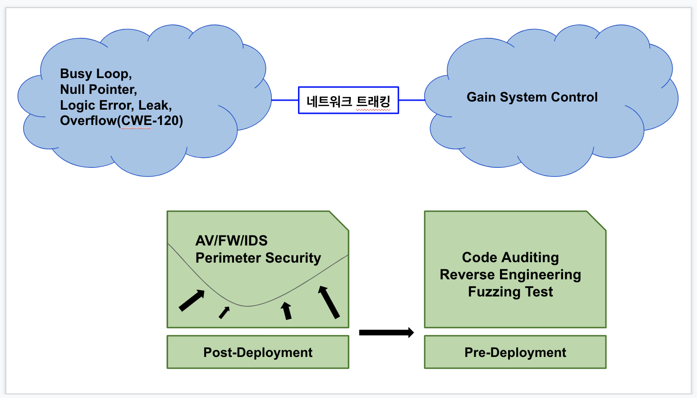
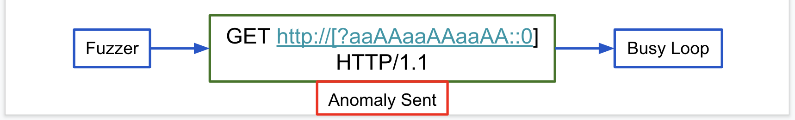

# IoT Defensics - KMS Tech.  

- 제한된 리소스로 IoT에 F/W 올리기 어려움  
- 동일한 구성을 가진 다수의 디바이스 사용으로 보안취약점의 파급효과가 큼  
- 서버측 보안 시스템에 비해 취약성 큼  
  -     보안이 강화된 커널을 사용해야 한다!

|과거|현재|
|:--:|:--:|
|QA부서|Sec부서|
|강건성 중요|시스템 무결성 중요|
-     QA문제가 보안문제가 된다  
-     CIA팩터를 체크하는 퍼징 테스트!  
__Communication Robustness Test__ : UL2900, ULCAP  

  
- __다양한 경로로 유입 --> 단일도구로는 대응이 어려움__  
- 정적분석 : 코드분석, 코딩실행이 없음, 상대적으로 저렴  
- 동적분석 : 퍼징
- Composition 분석 : 오픈소스  
  - 소스코드 바이너리 스캔하여 지문추출(시그니처)  
  - 사용된 component/library 취약점 확인  
# Security Development Lifecycle  
__커버리지 테스트 Acceptance Test --> 퍼징 테스트, 침투 테스트 Anomaly Test__  
- __국방 무기체계 S/W 신뢰성 시험__
  - Coverity : 정적  
  - PT-10 : 동적  
- __Attack Surface__
  - 802.11, BLE, CSS, X.509, ...  
-----
  
- 
||Positive Test|Negative Test|
|:--:|:--:|:--:|
|Coverage|유한|무한|
||정상입력|비정상입력|
||Unit Test|Random Test|
||Compliance Test|Fuzz Test|
||Function Test|Penetrate Test|
|(ex)|Age 99|Age 1=1|

- __Input Anomalies__
  - Field Level : Length, Type, Version 등의 필드. Overflow 
  - Structural   Underflow, Repetition  
  - Sequence Level : 센서에서 보내는 것에 대한 reponse를 omitting 또는 spamming  
    -     Underflow : 일부요소를 빼거나 비완성된 테스트케이스로 시스템 오동작 일으킴 
    -     Overflow : 메모리릭 등으로 시스템 오동작
- __Expose Vulnerabilities__
  - Trashing  
  
|by method|Mutation(Random Fuzzer)|Generation|
|:--:|:--:|:--:|
|Test Case 생성|Random|퍼저가 자체생산, Logic 가짐|
|범위|범용적|특정 프로토콜|
|성격|x Intelligence|o Intelligence|

|Pump Random Bits at a Port(현실적)|Transient(과도기)|Knows Every Protocols(이상적)|
|:--:|:--:|:--:|
|프로토콜에 대한 지식 전무|캡쳐떠서 anomaly 추가|Test Case Leaks like Real Messages|
|침팬지가 세익스피어 희곡 쓸 확률|세션ID를 고려못함(버려버림)|정상적인 통신이라 착각|
